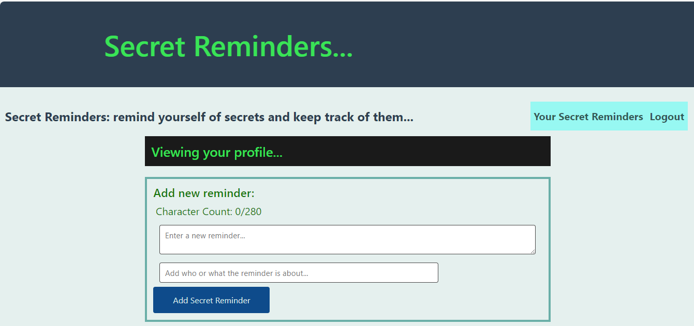
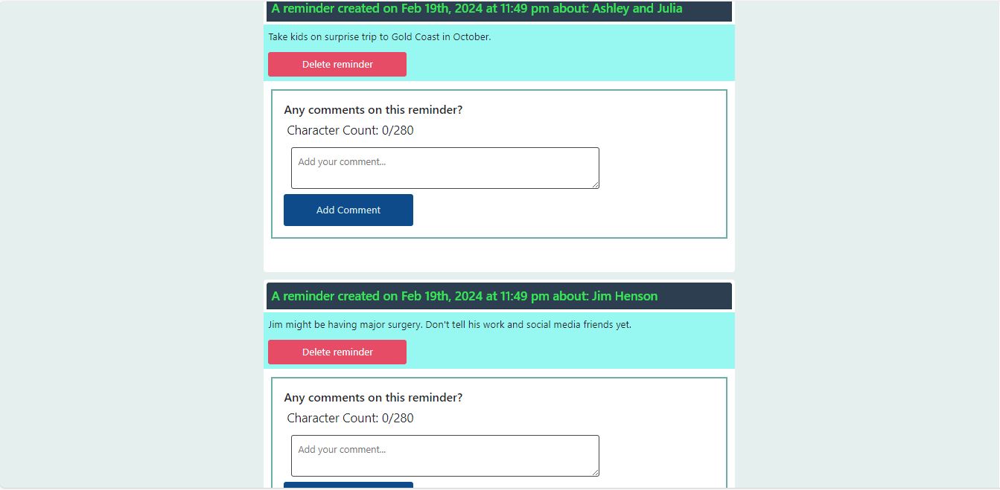

# Project 3: Secret Reminders
## Description
- An app to help users remember and keep track of secrets.
This app features: 
- Login and signup functions 
- Ability to add reminders, which includes the date and time it is added, and the subject/topic of the reminder.
- Remove reminders
- Adding other comments
- A character limit of 280

## Technologies Used
- React for the front end.
- GraphQL with a Node.js and Express.js server.
- MongoDB and the Mongoose ODM for the database.
- Authentication via JSON Web Token (JWT).
- Bootstrap for CSS.
- Googleapis/ fonts.
- Deployed using Render.

## Screenshot

## Link to Application
https://secret-reminders-rb.onrender.com/